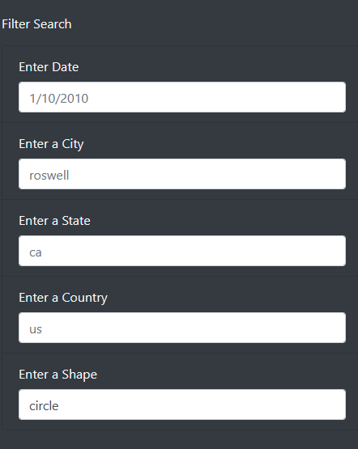
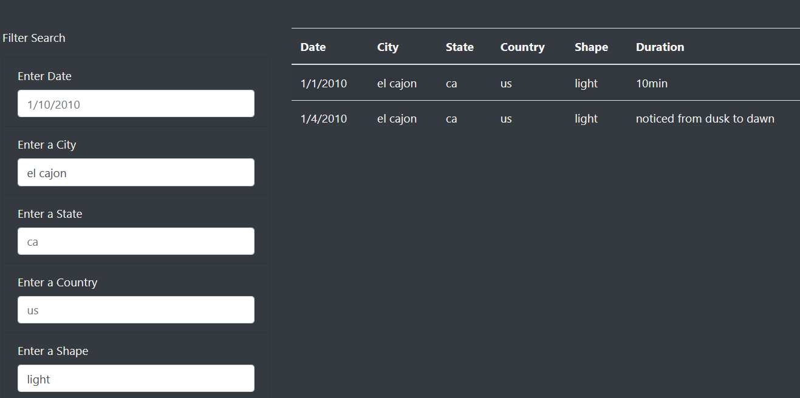

# UFOs

## Purpose of UFOs Analysis:
### Dana, a data journalist, wants us to design a webpage that will showcase her article about UFO sightings in McMinnville, Oregon. Additionally, she has tasked us to create table filters that will help users filter her UFO dataset for the following criteria: date, city, state, country, and shape.

## Results:

### <u>Performing a search:</u>

### As can be seen in the picture above, we have created a filter search form that will allow users to input a date, city, state, country, and shape. In order to not confuse users, we have made sure to include a text placeholder for each entry field, so that users know what the input field should look like. The search is not limited to one result. If desired, multiple search criteria can be entered at once. If we try to search for the city "el cajon," we get five results. However, when specifying the shape of the UFO, we only get two results as can be seen below.
 

 

### Basically, every time a user inputs text into one of the search fields, JavaScript's D3 library identifies the change and then triggers our filter function to be executed in the backend. The filter function loops through the dataset, and only extracts the key-value pairs corresponding to the user's input. The function then creates a new table with the filtered results.
 

## Summary:

### This webpage is a convenient way of quickly finding data that pertains to UFO sightings across North America.

### <u>Drawbacks:</u>
- ### One shortcoming, however, is that the information provided is static. This means that if there are errors or new sightings to be included, Dana would have to manually update the dataset files on the server. 

- ### Furthermore, the webpage's filter search form does not help the user to autocomplete search inputs. For example, if a user does not know the exact name of the city but knows that it stars with "El," then the user should be able to get a result back with at least one city name starting with "El". This is not the case, however, making it harder for the user to get the search results that they are looking for. The input field is also case-sensitive, so El Cajon would yield no search results.

### <u>Recommendations:</u>
 1. ### It would be great to make the webpage dynamic. I would try to find or create an Api that is up-to-date with the latest UFO sightings. By doing so, Dana does not have to constantly update her webpage.
 2. ### Instead or in addition to using a table, I would use something like the Google Maps Api to visually showcase my findings. This would not only display all the information provided in the table, but also help users to have a better visual understanding of all the UFO sightings in North America.
 3. ### Lastly, the webpage is missing a comment section. People want to engage with the webpage's content. User feedback is an excellent way to get UFO enthusiast together and make them engage with the webpage.

